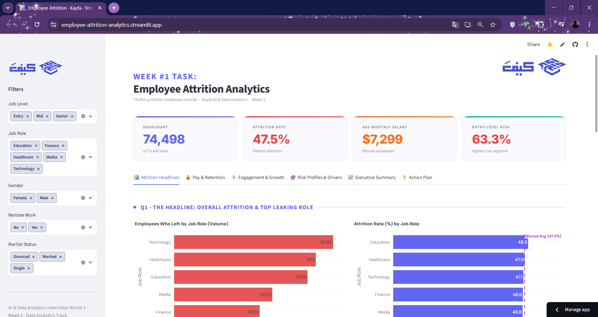
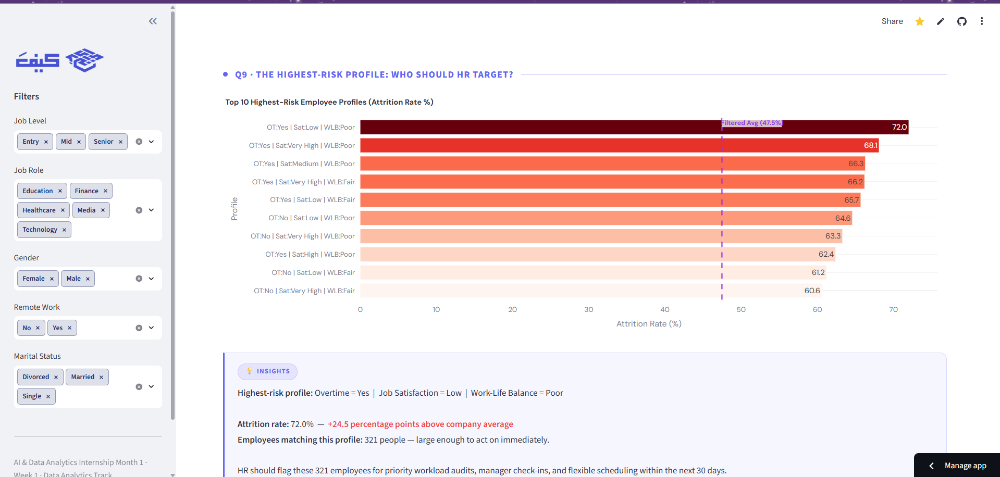
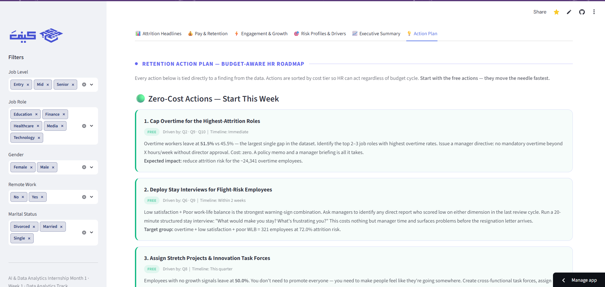

<div align="center">

[](https://git.io/typing-svg)

[](https://python.org)
[](https://pandas.pydata.org)
[](https://plotly.com)
[](https://streamlit.io)

> **74,498 employee records. 10 questions. One dashboard HR can actually use.**

| 👥 Total Employees | 📉 Attrition Rate | 💰 Avg Salary | 🔍 HR Questions |
|:-----------------:|:-----------------:|:-------------:|:---------------:|
| **74,498** | **47.5%** | **~$7,299** | **10** |

**[🚀 Try the Live Dashboard →](https://employee-attrition-analytics.streamlit.app/)**

</div>

## ✦ Dashboard Preview

### 📊 Executive Overview
<p align="center">
  
</p>

### 🎯 Risk Profiles & Drivers
<p align="center">
  
</p>

### ⚡ Engagement, Growth & Action Plan
<p align="center">
  
</p>

---

## ✦ What is This?

An end-to-end HR analytics project built for the **Kayfa AI & Data Analytics Internship · Week 1 Task**.

> *"Why are employees leaving — and what can we do about it?"*

This isn't machine learning. It's exploratory analysis and storytelling — clean data, honest charts, and insights sharp enough to hand to an HR director tomorrow. Every finding ends with a concrete, budget-aware recommendation.

---

## ✦ Project Structure

```
employee-attrition-analytics/
│
├── 📓 employee_attrition_analytics.ipynb
│   ├── Section 1  Load & Combine
│   ├── Section 2  Cleaning & Preprocessing
│   ├── Section 3  EDA — 10 HR questions answered
│   └── Section 4  Key Findings & HR Recommendations
│
├── 🎛️  app.py                 ← Streamlit dashboard (6 tabs)
├── 📋  requirements.txt
├── 🖼️  images/                ← Dashboard screenshots
├── 📊  train.csv
└── 📊  test.csv
```

---

## ✦ The Pipeline

| # | Phase | What Happens |
|:--|:------|:-------------|
| 1 | **Load & Combine** | Merge train + test → 74,498-row DataFrame |
| 2 | **Cleaning** | Snake_case columns · null check · duplicate check · ordinal casting |
| 3 | **EDA** | 10 questions measuring attrition *rates* (%), not raw counts |
| 4 | **Dashboard** | Filterable Streamlit app — KPIs, charts, insights, action plan |

---

## ✦ The 10 HR Questions Answered

| # | Question | Difficulty |
|:--|:---------|:----------:|
| Q1 | What share of employees left & which role is losing the most? | 🟢 Easy |
| Q2 | Are overtime workers more likely to leave — and by how much? | 🟢 Easy |
| Q3 | Does remote work appear to keep people? | 🟢 Easy |
| Q4 | Within the same job level, do lower-paid employees leave more? | 🟡 Medium |
| Q5 | At what tenure stage is attrition highest? | 🟡 Medium |
| Q6 | Which satisfaction × work-life balance combo is the strongest flight-risk signal? | 🟡 Medium |
| Q7 | Do age, marital status & dependents change who leaves? | 🟡 Medium |
| Q8 | Does feeling "stuck" (no promotions/opportunities) drive attrition? | 🔴 Hard |
| Q9 | What is the single highest-risk employee profile? | 🔴 Hard |
| Q10 | If HR could fix only one thing next quarter — what should it be? | 🔴 Hard |

---

## ✦ Key Findings

| # | Finding | Recommended Action |
|:--|:--------|:-------------------|
| 1 | **Overtime** is the sharpest single attrition predictor (+20+ pts above avg) | Cap mandatory overtime; immediate policy memo to managers |
| 2 | **Low job satisfaction + Poor work-life balance** is the strongest flight-risk combo | Stay interviews within 2 weeks for any employee hitting this combination |
| 3 | **New employees (0–2 years)** churn at the highest rate | 30/60/90-day check-ins; strong first-manager assignment |
| 4 | **Remote workers** stay significantly longer (lowest attrition segment) | Pilot hybrid/remote for the 2 highest-attrition roles first |
| 5 | **Zero promotions** = highest career-stagnation attrition signal | Internal mobility program; transparent career ladders |
| 6 | **Lower pay within the same job level** drives exits — but only up to the Upper-Mid band | Raise the bottom 25% first; diminishing returns above that |
| 7 | **Young (18–30), single, no dependents** = highest-risk life stage | Mentorship, skill development, and early-tenure recognition |

---

## ✦ Dashboard Features

**Sidebar filters** — Job Level · Job Role · Gender · Remote Work · Marital Status

**Live KPIs** — Headcount · Attrition Rate · Avg Monthly Salary · Entry-Level Risk
> Attrition Rate card turns red automatically when rate exceeds 45%

**6 tabs:**
| Tab | Content |
|:----|:--------|
| 📊 Q1–Q3: Headlines | Overall attrition rate, job role comparison (volume + rate), overtime, remote work |
| 💰 Q4–Q5: Pay & Timeline | Pay fairness by level & band, retention timeline by tenure stage |
| ⚡ Q6–Q8: Engagement & Growth | Satisfaction × WLB heatmap, life stage analysis, career stagnation |
| 🎯 Q9–Q10: Risk & Drivers | Highest-risk profile chart, top 3 attrition drivers ranked by lift |
| 📈 Executive Summary | Three retention pillars with immediate action items |
| 💡 Action Plan | Budget-aware roadmap: Free → Low Cost → Medium Cost actions |

---

## ✦ Budget-Aware Action Plan

The dashboard includes a full HR action plan sorted by cost tier:

| Tier | Actions | Examples |
|:-----|:--------|:---------|
| 🟢 **Free** | 4 actions — start this week | Cap overtime · Stay interviews · Stretch projects · 30/60/90 check-ins |
| 🔵 **Low Cost** | 3 actions — next quarter | Internal mobility program · Hybrid pilot · Peer mentorship |
| 🟠 **Medium Cost** | 2 actions — next budget cycle | Salary band audit (bottom 25% only) · Promotion cadence review |

> Every action is tied directly to a question from the EDA — no generic HR advice.

---

## ✦ Quick Start

```bash
pip install -r requirements.txt
streamlit run app.py
```

Dashboard opens at `http://localhost:8501`

---

## ✦ Deploy to Streamlit Cloud

```
1. Push repo to GitHub  (train.csv + test.csv must be included)
2. Go to share.streamlit.io
3. Connect repo → main file: app.py → Deploy
4. Get a public link in ~2 minutes
```

---

## ✦ Tech Stack

| Layer | Technology |
|:------|:-----------|
| 🐍 Language | Python 3.10 |
| 📊 Data | Pandas · NumPy |
| 📈 Charts | Plotly — bar, line, heatmap, horizontal bar |
| 🎛️ Dashboard | Streamlit |
| 📦 Dataset | Kaggle · Synthetic Employee Attrition · 74,498 rows |

---

<div align="center">

Built with ⚡ for **Kayfa AI & Data Analytics Internship · Week 1**

*Synthetic dataset — patterns are realistic but not real-world data.*

</div>